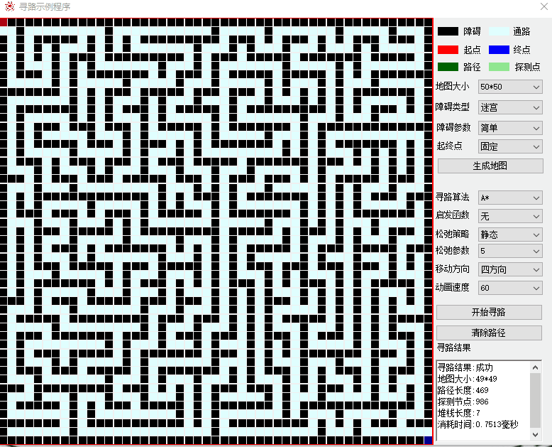

# AStar Pathfinding Demo
This program is a demonstration program for the author's graduation thesis at the C9 school beginning with s to attend the School of Continuing Education (repaying the debt of high school dropout). According to the relevant confidentiality regulations, the program is over-shelled, and the author also prepared some easter eggs for readers.

# There are  some screenshots of the program and a description of the screenshot below.
---
# Stack based random pathfinding algorithm demonstration
###### The map size is 50*50, the obstacle type is random, the obstacle parameter is 5%, and the starting and ending points are fixed. There is no heuristic function, and the moving direction is the result of running in four directions:

###### It can be seen that the random pathfinding algorithm detects most of the nodes, and finally finds a path with a path length of 433 (the green part), which takes 12.76 milliseconds.

---

###### The map size is 50*50, the obstacle type is random, the obstacle parameter is 5%, and the starting and ending points are fixed. There is no heuristic function, and the moving direction is eight-direction operation result:

###### You can see that the random pathfinding algorithm detects most of the nodes, and finally finds a path with a path length of 1197 (the green part), which takes 4.83 milliseconds. It can be seen that the pure random algorithm fluctuates too much.

---

###### The map size is 50*50, the obstacle type is random, the obstacle parameter is 5%, and the starting and ending points are fixed. The heuristic function Manhattan distance, the moving direction is four directions, the running result:

###### After applying the heuristic function, the number of detection nodes is reduced to 134, the path length (green part) is only 99, and the running time is also reduced to 0.10 milliseconds, a reduction of an order of magnitude.

---

###### The map size is 50*50, the obstacle type is random, the obstacle parameter is 5%, and the starting and ending points are fixed. The heuristic function Manhattan distance, the moving direction is eight directions, running results:

###### The result of allowing eight-direction movement is similar to that of four-direction. There are 116 detection nodes and the running time is 0.13 milliseconds, which is basically on the order of magnitude.

---

###### The map size is 50*50, obstacle type maze, natural maze type, fixed starting and ending points. There is no heuristic function, and the moving direction is the result of running in four directions:

###### It can be seen that when the algorithm detects 729 nodes in the maze, it finds a path with a length of 481 (green part), and the running time is 0.92 milliseconds.

---

###### The map size is 50*50, obstacle type maze, natural maze type, fixed starting and ending points. The heuristic function Manhattan distance, the moving direction is four directions, the running result:

###### It can be seen that in the maze map (dense map), the heuristic function is not very useful

---

# Astar pathfinding algorithm demonstration

---

###### The map size is 50*50, the obstacle type is random, the obstacle parameter is 5%, and the starting and ending points are fixed. There is no heuristic function, and the moving direction is the result of running in four directions:

###### As mentioned earlier, when the A* pathfinding algorithm does not use heuristic functions, it will degenerate into the Dijkstra algorithm. The algorithm will detect all passable nodes, and the final path is the shortest path. Although the shortest path was found, there are too many detection nodes 2369, and the running time of 2.26 milliseconds seems too long. The following is the result of running the heuristic function.

---

###### The map size is 50*50, the obstacle type is random, the obstacle parameter is 5%, and the starting and ending points are fixed. The heuristic function Manhattan distance, the moving direction is four directions, the running result:

###### It can be seen that after using the heuristic function, the number of detection nodes is reduced to the same number as the shortest path length, and the running time has also dropped by an order of magnitude. The result of this run happens to be the coincidence of all the detection nodes and the shortest path, because the sample program implementation is Starting from left to right, find adjacent nodes clockwise, resulting in the resulting path at the edge of the map.

---

###### The map size is 50*50, the obstacle type is random, the obstacle parameter is 5%, and the starting and ending points are fixed. The heuristic function Manhattan distance, the moving direction is eight directions, running results:

###### After allowing eight directions to move, the pathfinding length is greatly reduced. The detection node and the shortest path are also completely overlapped in this run. Such perfect operation often occurs in maps with few obstacles. Readers can experiment to adjust the obstacle parameters, increase the number of obstacles, the detection nodes will be more than the path length and will not completely overlap.

---

###### The map size is 50*50, the obstacle type is random, the obstacle parameter is 5%, and the starting and ending points are fixed. The heuristic function Euclidean distance, the moving direction is eight directions running results:

###### It can be seen that the same map will detect more nodes if the Euclidean distance heuristic function is used. And the running time has also increased. This is because the Euclidean distance function has errors in the floating point number during the square root calculation process, which causes the path to not converge quickly. The following will adjust the relaxation strategy parameters to run again.

---

###### The map size is 50*50, the obstacle type is random, the obstacle parameter is 5%, and the starting and ending points are fixed. The heuristic function Euclidean distance, the relaxation strategy is static, the relaxation parameter is 5, and the moving direction is eight directions.

###### After adjusting the static relaxation parameter to 5, it can be seen that the detection node and the final path are completely overlapped, and the running time is restored to the running time of the Manhattan distance heuristic function. It should be noted that although the running time is reduced, the final path length is increased, and a suboptimal path is finally found. In the actual application process, attention should be paid to balance the running time and the pathfinding effect, and choose the appropriate relaxation strategy and parameters.

---

###### The map size is 50*50, obstacle type maze, natural maze type, fixed starting and ending points. There is no heuristic function, and the moving direction is the result of running in four directions:

###### The map size is 50*50, obstacle type maze, natural maze type, fixed starting and ending points. The heuristic function Manhattan distance, the relaxation strategy is static, the relaxation parameter is 5, and the moving direction is four directions:

###### After adjusting the parameters of the relaxation strategy, an almost identical path was found, and the algorithm running time remained flat.
