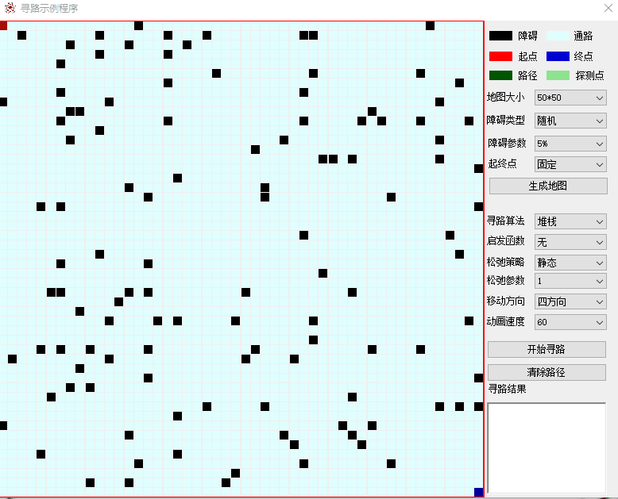
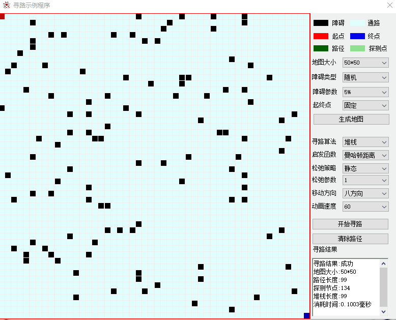
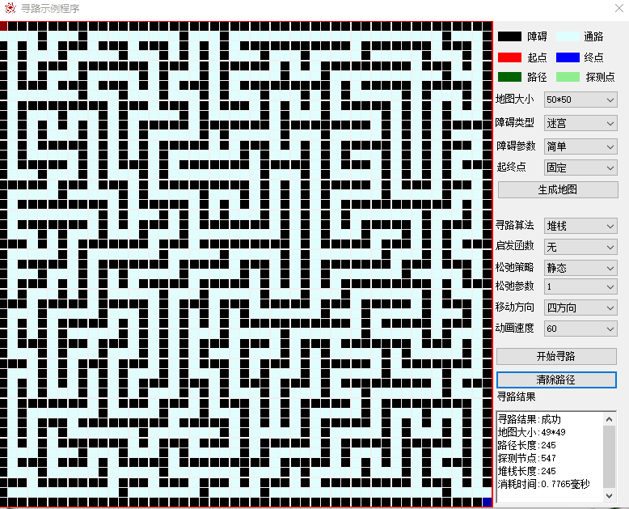
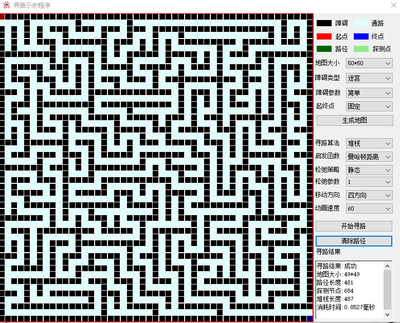
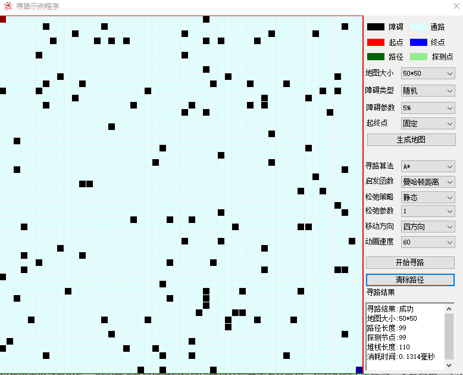
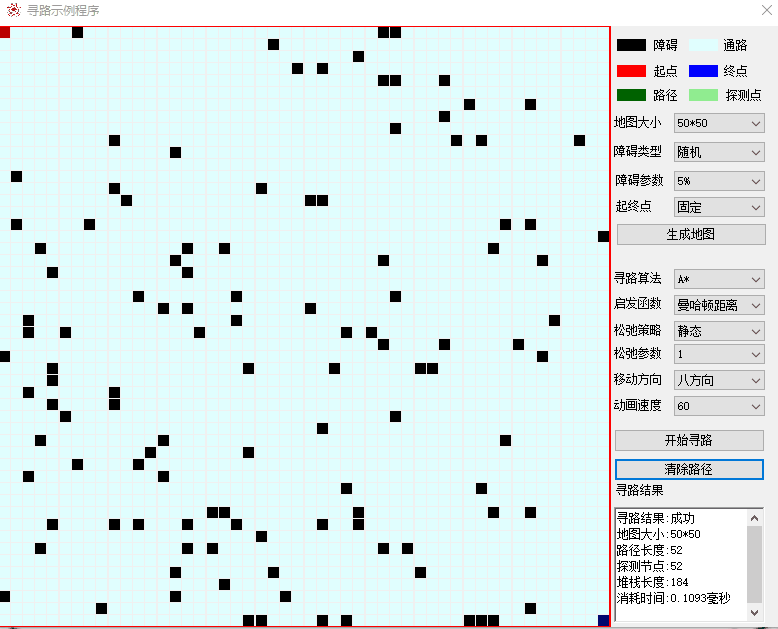
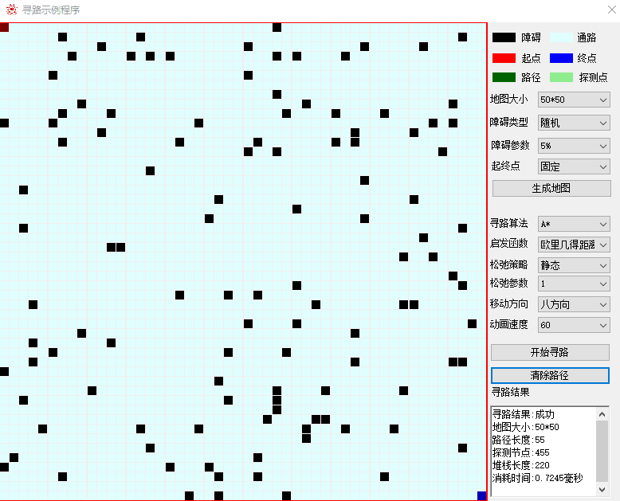

# A*寻路示例程序
本程序是作者在s开头的C9学校读继续教育学院(还高中时代辍学的债)毕业论文的演示程序。根据相关保密规定，程序是加过壳的，作者还给读者准备了一些彩蛋。

## 下面是程序的运行截图以及截图说明。
---
# 栈随机寻路算法演示
###### 地图大小选择50*50，障碍类型随机，障碍参数5%，起终点固定。启发函数无，移动方向为四方向运行结果：

###### 可以看到随机寻路算法探测了大部分节点，最后找到一条路径长度为433的路径(绿色部分)，耗时12.76毫秒。

---

###### 地图大小选择50*50，障碍类型随机，障碍参数5%，起终点固定。启发函数无，移动方向为八方向运行结果：

###### 可以看到随机寻路算法探测了大部分节点，最后找到一条路径长度为1197的路径(绿色部分)，耗时4.83毫秒，可以看出纯随机算法波动太多。

---

###### 地图大小选择50*50，障碍类型随机，障碍参数5%，起终点固定。启发函数曼哈顿距离，移动方向为四方向运行结果：

###### 在应用了启发函数后，探测节点减少到了134个，路径长度(绿色部分)也只有99，运行时间也缩短到0.10毫秒，减少了一个数量级。

---

###### 地图大小选择50*50，障碍类型随机，障碍参数5%，起终点固定。启发函数曼哈顿距离，移动方向为八方向运行结果：

###### 允许八方向移动的运行结果和四方向差不多，探测节点为116个，运行时间0.13毫秒，基本上在一个数量级上。

---

###### 地图大小选择50*50，障碍类型迷宫，迷宫类型自然，起终点固定。启发函数无，移动方向为四方向运行结果：

###### 可以看到在算法在迷宫中进行寻路时探测了729个节点，找到一条长度为481的路径(绿色部分)，运行时间为0.92毫秒。

---

###### 地图大小选择50*50，障碍类型迷宫，迷宫类型自然，起终点固定。启发函数曼哈顿距离，移动方向为四方向运行结果：

###### 可以看到在迷宫类地图（稠密图）中，启发函数作用不是太大

---

# A*寻路算法演示

---

###### 地图大小选择50*50，障碍类型随机，障碍参数5%，起终点固定。启发函数无，移动方向为四方向运行结果：

###### 如前文所述，当A*寻路算法不使用启发函数时将会退化成Dijkstra算法，算法将会探测所有可通过节点，最终得到的路径是最短路径。虽然找到了最短路径，但是探测节点2369实在太多，运行时间2.26毫秒显得太长，下面是使用启发函数运行结果。

---

###### 地图大小选择50*50，障碍类型随机，障碍参数5%，起终点固定。启发函数曼哈顿距离，移动方向为四方向运行结果：

###### 可以看到使用启发函数以后，探测节点数量缩减到和最短路径长度差不多的数量，运行时间也下降了一个数量级，本次运行结果正好是所有探测节点和最短路径重合的情况，由于示例程序实现是从左向右开始顺时针查找邻接节点，导致产生的路径在地图的边缘。

---

###### 地图大小选择50*50，障碍类型随机，障碍参数5%，起终点固定。启发函数曼哈顿距离，移动方向为八方向运行结果：

###### 允许八方向移动后寻路长度大大减少，本次运行探测节点与最短路径也是完全重合，在障碍少的地图中经常出现这样完美运行的情况。读者可以试验一下调整障碍参数，增加障碍数量，探测节点就会多于路径长度而且不会完全重合。

---

###### 地图大小选择50*50，障碍类型随机，障碍参数5%，起终点固定。启发函数欧里几德距离，移动方向为八方向运行结果：

###### 可以看到同样的地图采用欧里几德距离启发函数就会探测较多的节点。并且运行时间也增加了，这是因为欧里几德距离函数在计算平方根过程中浮点数有误差，导致路径没有快速收敛，下面将调整松弛策略参数再次运行。

---

###### 地图大小选择50*50，障碍类型随机，障碍参数5%，起终点固定。启发函数欧里几德距离，松弛策略静态，松弛参数5，移动方向为八方向运行结果：

###### 调整静态松弛参数为5以后，可以看到探测节点与最终路径完全重合了，运行时间也恢复到曼哈顿距离启发函数的运行时间。要注意的是虽然运行时间减少了，但是却增加了最终路径长度，最终找到的是一条次优路径。在实际应用过程中注意要平衡运行时间和寻路效果，选择合适的松弛策略和参数。

---

###### 地图大小选择50*50，障碍类型迷宫，迷宫类型自然，起终点固定。启发函数无，移动方向为四方向运行结果：

###### 地图大小选择50*50，障碍类型迷宫，迷宫类型自然，起终点固定。启发函数曼哈顿距离，松弛策略静态，松弛参数5，移动方向为四方向运行结果：

###### 调整松弛策略参数后找到几乎相同的一条路径，算法运行时间持平。
